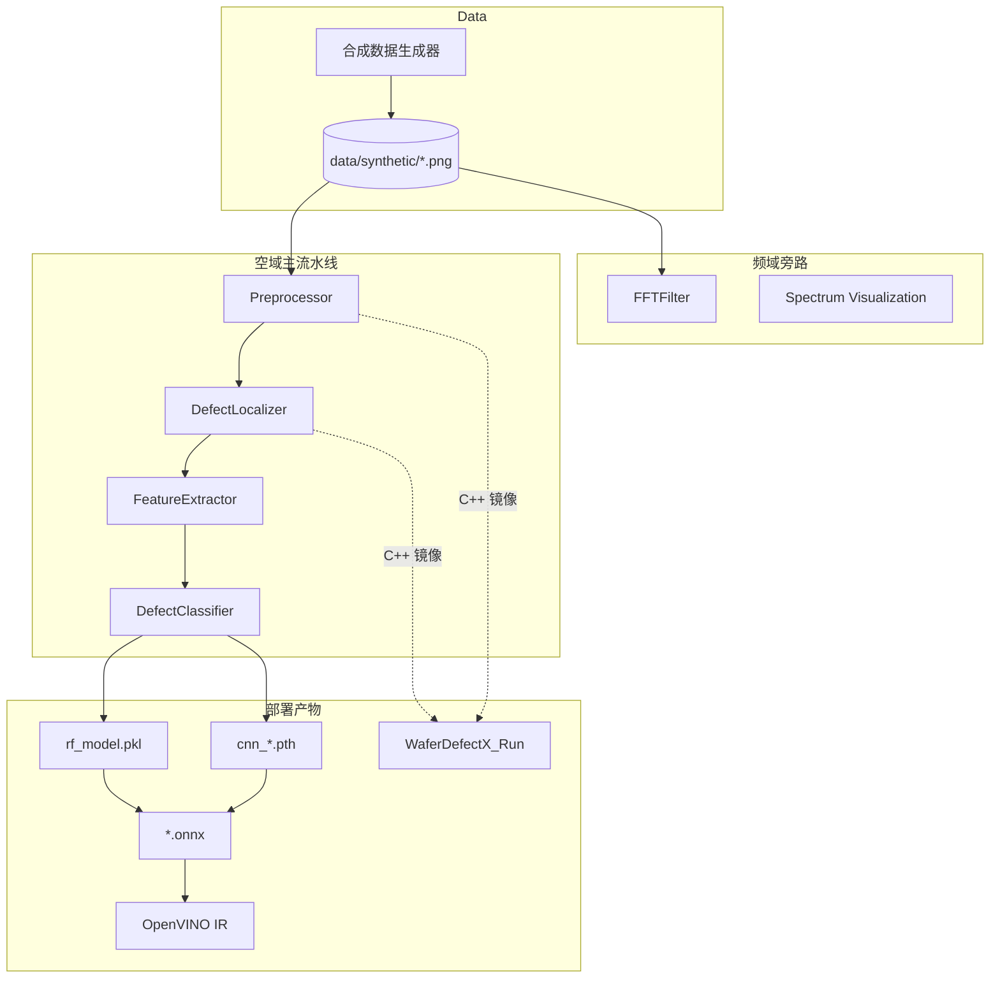
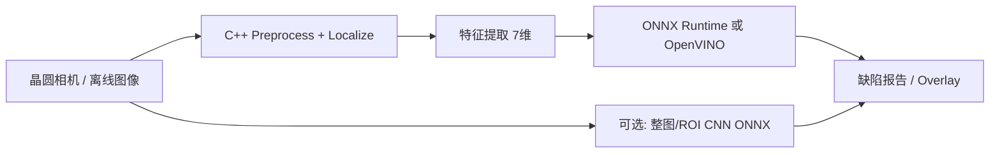

# WaferDefectX 详细设计文档

| 字段 | 内容 |
|------|------|
| 文档版本 | 1.0 |
| 项目名称 | WaferDefectX |
| 作者 | Ashik Sharon M / 文档整理基于现有代码库 |
| 日期 | 2026-01（代码） / 2026-07（文档） |
| 状态 | 基于当前仓库实现的设计说明 |

---

## 1. 概述

### 1.1 目标

WaferDefectX 是一套面向半导体晶圆表面缺陷自动检测的端到端计算机视觉与机器学习流水线，模拟 fab 中高通量自动光学检测（AOI）工具的核心能力：

1. 在晶圆图像上**定位**表面缺陷区域（ROI）
2. 对缺陷候选区域进行**分类**（划痕 / 颗粒 / 良品相关噪声等）
3. 提供从 **Python R&D 原型** 到 **C++ 生产核心** 以及 **ONNX / OpenVINO 部署** 的完整路径

### 1.2 设计原则

| 原则 | 说明 |
|------|------|
| 混合检测 | 定位用经典 CV（快、可解释、少标注）；分类用 ML/DL |
| 模块化 | 预处理、定位、特征、分类、频域、导出各自独立 |
| 双栈演进 | Python 验证算法；C++ 复刻关键路径以降低延迟 |
| 部署友好 | 支持 scikit-learn → ONNX / OpenVINO，以及 CNN → ONNX / INT8 |
| 数据可自给 | 内置合成晶圆图生成器，不依赖真实产线数据即可跑通 |

### 1.3 非目标（当前版本）

- 非完整 MES/AOI 产线集成系统（无任务调度、无设备协议）
- 无形式化单元测试框架 / CI
- 无 Docker / K8s 部署清单
- C++ 路径当前仅覆盖**预处理 + 定位**，不含特征提取与分类

---

## 2. 系统架构

### 2.1 逻辑架构



### 2.2 物理目录结构

```
WaferDefectX/
├── python/                  # R&D 与训练 / 导出
│   ├── data_generator.py
│   ├── preprocessing.py
│   ├── defect_localization.py
│   ├── features.py
│   ├── classifier.py
│   ├── cnn_model.py
│   ├── train_eval.py        # RF/SVM 特征训练
│   ├── train_cnn.py         # CNN 训练 + INT8
│   ├── export_to_onnx.py
│   ├── export_to_openvino.py
│   ├── export_to_openvino_hb.py
│   ├── export_cnn_to_onnx.py
│   ├── main.py              # 检测可视化 Demo
│   ├── benchmark.py
│   └── generate_*.py        # 结果拼图 / Portfolio
├── cpp/                     # 生产向 CV 核心
│   ├── preprocess.cpp
│   ├── defect_localization.cpp
│   ├── main.cpp
│   └── CMakeLists.txt
├── frequency_analysis/      # FFT 降噪与频谱可视化
├── data/synthetic/          # 合成晶圆图
├── results/                 # 模型与可视化产物
└── benchmarks/              # 系统级性能脚本
```

### 2.3 运行时路径约定

多数 Python 脚本硬编码相对路径前缀 `WaferDefectX/...`，约定**工作目录为仓库父目录**（例如 `code/`），而非仓库根目录。CNN 相关脚本（`train_cnn.py`、`export_cnn_to_onnx.py`）使用基于 `__file__` 的相对路径，可从仓库内更稳健地运行。

---

## 3. 数据设计

### 3.1 合成数据生成（`WaferDataGenerator`）

| 参数 | 默认值 | 说明 |
|------|--------|------|
| 分辨率 | 800×800 | 灰度图 |
| 晶圆半径 | `min(W,H) * 0.45` | 圆形盘片 |
| 背景灰度 | ~100 + N(0,5) 噪声 | 模拟表面纹理 |
| 缺陷概率 | 70% | 否则标记为 `good` |
| 缺陷类型 | scratch / particle | 各约一半 |

**划痕（scratch）**：盘内随机线段，灰度约 200，线宽 1–3 px，长度 20–100 px。

**颗粒（particle）**：盘内随机亮斑，半径 2–6 px，灰度约 220。

**文件命名约定**

```
wafer_<NNNN>_<label>.png
label ∈ {good, scratch, particle}
```

标签从文件名解析，供 `train_eval.py` / `WaferPatchDataset` 使用。

### 3.2 数据集现状

- 仓库已包含一批合成样本于 `data/synthetic/`
- 可通过 `data_generator.py` 重新生成（默认约 50 张）
- 规划中支持真实 WM-811K，当前未实现解析器

### 3.3 类别定义

| 标签 | 含义 | 经典 CV+RF 路径 | CNN 路径 |
|------|------|-----------------|----------|
| `good` | 无明显缺陷 | 训练时通常跳过（无有效轮廓则丢弃） | 类别 0 |
| `particle` | 颗粒/点状异物 | 类别字符串 | 类别 1 |
| `scratch` | 划痕 | 类别字符串 | 类别 2 |

---

## 4. 空域检测流水线设计

### 4.1 端到端数据流

```
Raw Image (BGR/Gray)
    │
    ▼
┌───────────────────┐
│  Preprocessor     │  Gray → Gaussian → Median → CLAHE
│                   │  (+ Adaptive Threshold 可选输出)
└─────────┬─────────┘
          │ enhanced (uint8 gray)
          ▼
┌───────────────────┐
│ DefectLocalizer   │  Canny → Morph Close → Contours → BBoxes / Mask
└─────────┬─────────┘
          │ contours[]
          ▼
┌───────────────────┐
│ FeatureExtractor  │  每轮廓 → 7 维特征向量
└─────────┬─────────┘
          │ X ∈ R^7
          ▼
┌───────────────────┐
│ DefectClassifier  │  RF / SVM / ONNX / OpenVINO / CNN
└─────────┬─────────┘
          │ label
          ▼
     Report / Overlay
```

### 4.2 预处理模块（`Preprocessor`）

**职责**：降噪与局部对比度增强，为边缘检测提供稳定输入。

| 步骤 | 算法 | 参数 | 目的 |
|------|------|------|------|
| 灰度化 | BGR→Gray | — | 统一通道 |
| 高斯模糊 | `GaussianBlur` | ksize=(5,5), σ=0 | 抑制高频噪声 |
| 中值滤波 | `medianBlur` | ksize=5 | 抑制椒盐噪声 |
| CLAHE | `createCLAHE` | clipLimit=2.0, tile=8×8 | 局部对比度增强 |
| 自适应阈值 | `adaptiveThreshold` | ADAPTIVE_THRESH_GAUSSIAN_C, BINARY_INV, block=11, C=2 | 可选二值图 |

**输出**：

- `enhanced`：CLAHE 后灰度图（定位主输入）
- `thresholded`：自适应阈值结果（当前定位主路径未强制使用）

**C++ 对齐**：`cpp/preprocess.cpp` 复刻 Gray→Gaussian→Median→CLAHE；额外做空图检查与奇数核断言。`get_thresholded()` 与 Python 阈值参数一致。

### 4.3 缺陷定位模块（`DefectLocalizer`）

**职责**：在增强图上找出缺陷候选轮廓与包围盒。

| 步骤 | 算法 | 参数 | 目的 |
|------|------|------|------|
| 边缘检测 | Canny | low=50, high=150 | 提取缺陷边界 |
| 形态学闭运算 | MORPH_CLOSE | 5×5 RECT | 连接断裂边缘 |
| 轮廓提取 | `findContours` | RETR_EXTERNAL, CHAIN_APPROX_SIMPLE | 外轮廓 |
| 面积过滤 | `contourArea` | min_area=10 | 去除噪声点 |
| Mask 生成 | `drawContours` FILLED | — | 区域掩膜 |

**输出结构（Python）**

```python
{
  "edges": ndarray,       # Canny 结果
  "clean_map": ndarray,   # 闭运算后
  "contours": list,       # 有效轮廓
  "bboxes": [(x,y,w,h)],
  "mask": ndarray         # 二值掩膜
}
```

**C++ 对齐**：`DefectResult { contours, bboxes, mask, edges }`；参数与 Python 一致；强制单通道输入。

**设计取舍**：相对 YOLO 等检测网络，经典定位延迟更低、边界可解释、对小样本友好，适合高 WPH 场景的粗定位。

### 4.4 特征提取模块（`FeatureExtractor`）

对每个缺陷轮廓构造 **7 维特征向量**（与 ONNX/OpenVINO 输入维度绑定）：

| 索引 | 特征 | 定义 |
|------|------|------|
| 0 | area | 轮廓面积 |
| 1 | perimeter | 轮廓周长 |
| 2 | aspect_ratio | w / h |
| 3 | rectangularity | area / (w·h) |
| 4 | circularity | 4π·area / perimeter² |
| 5 | mean_intensity | 掩膜内灰度均值 |
| 6 | std_intensity | 掩膜内灰度标准差 |

几何特征区分划痕（细长、低圆度）与颗粒（近圆、高圆度）；纹理特征补充对比度信息。

**训练简化策略**（`train_eval.py`）：若一图多轮廓，仅取**面积最大**轮廓作为该图样本。生产系统应对每个轮廓独立分类。

### 4.5 分类模块（`DefectClassifier`）

工厂式构造，支持：

| `model_type` | 后端 | 输入 | 备注 |
|--------------|------|------|------|
| `rf` | `RandomForestClassifier(n_estimators=100)` | 7 维特征 | 默认训练路径 |
| `svm` | `SVC(kernel='rbf', probability=True)` | 7 维特征 | 备选 |
| `onnx` | onnxruntime | float32 `[N,7]` | 加载 `.onnx` |
| `openvino` | OpenVINO Runtime | float32 `[N,7]` | 加载 `.xml`/`.onnx`；类别表写死为 good/particle/scratch |
| `cnn` | `WaferCNN` | 64×64 灰度 patch | 需 PyTorch；输入与特征路径不同 |

**训练评估**（`train_eval.py`）：

1. 全量合成图跑预处理+定位+特征
2. `train_test_split(test_size=0.3, random_state=42)`
3. 训练 RF → accuracy / classification_report / confusion_matrix
4. 持久化 `results/rf_model.pkl`

---

## 5. 深度学习分支设计

### 5.1 动机

经典特征对简单合成缺陷足够；复杂形貌、光照与纹理变化时，轻量 CNN 可端到端学习外观。与 RF 路径并行存在，通过 `DefectClassifier(model_type='cnn')` 接入。

### 5.2 WaferCNN 网络结构

**输入**：`(B, 1, 64, 64)`，灰度归一化到 `[0, 1]`

```
Conv2d(1→16, 3×3, pad1) + BN + ReLU + MaxPool2d(2)     → 32×32
Conv2d(16→32, 3×3, pad1) + BN + ReLU + MaxPool2d(2)    → 16×16
Conv2d(32→64, 3×3, pad1) + BN + ReLU + AdaptiveAvgPool(4) → 4×4
Flatten → Linear(1024→128) + ReLU + Dropout(0.3) → Linear(128→3)
```

- 参数量约 **75K**，面向边缘部署
- 权重初始化：Conv Kaiming、Linear Xavier
- 类别：`0=good, 1=particle, 2=scratch`

### 5.3 数据集与训练（`train_cnn.py`）

| 项 | 值 |
|----|-----|
| Dataset | `WaferPatchDataset`：整图 resize 到 64×64（非 ROI crop） |
| Split | 80/20，seed=42 |
| Epochs | 20 |
| Batch | 16 |
| Optimizer | Adam, lr=1e-3 |
| Loss | CrossEntropyLoss |
| 产物 | `cnn_wafer_model.pth`（FP32） |
| 量化 | 动态 INT8 → `cnn_wafer_model_quantized.pth` |

说明：当前 CNN 使用**整图缩放**，与经典路径「先定位再分类 ROI」不一致；适合原型验证，后续可改为按 bbox crop。

### 5.4 SOLID 抽象

`AbstractClassifier` 定义 `predict` / `save` / `load`；`WaferCNN` 同时继承 `nn.Module` 与该抽象，便于与工厂统一。

---

## 6. 频域分析设计

### 6.1 定位

`frequency_analysis/` 为**旁路增强模块**，用于强噪声 / 周期性噪声场景；非主定位路径的默认步骤。代价高于空域滤波，适合预处理增强或离线分析。

### 6.2 `FFTFilter` 能力

| API | 行为 |
|-----|------|
| `compute_fft` | OpenCV DFT，最优尺寸 padding，fftshift |
| `compute_magnitude_spectrum` | 对数幅度谱可视化 |
| `create_lowpass_filter` | 高斯低通掩膜（双通道 Real/Imag） |
| `create_bandstop_filter` | 陷波 / 带阻 |
| `denoise_wafer` | 低通降噪（默认 cutoff≈50） |
| `enhance_defects` | 带通（low≈5, high≈80）突出缺陷频带 |

**流程**：DFT → 乘掩膜 → IDFT → crop 回原尺寸 → normalize 到 uint8。

### 6.3 可视化

`spectrum_visualization.py` 生成频谱对比、滤波器响应等图，输出到 `results/`（如 `fft_filter_comparison.png`、`spectrum_analysis.png`）。

---

## 7. C++ 生产核心设计

### 7.1 目标

将 Python 预处理与定位路径移植为原生 C++，降低单图延迟（文档宣称约数倍加速，典型目标 &lt;10 ms，视分辨率与硬件而定）。

### 7.2 构建

- CMake ≥ 3.10，C++14
- 依赖：OpenCV（`find_package(OpenCV REQUIRED)`）
- 产物：
  - 静态/目标库 `wafer_core`（`preprocess.cpp` + `defect_localization.cpp`）
  - 可执行文件 `WaferDefectX_Run`

```bash
cd cpp && mkdir -p build && cd build
cmake .. && make
./WaferDefectX_Run <image_path>
```

### 7.3 运行时行为（`main.cpp`）

1. 参数校验：`Usage: ./WaferDefectX_Run <image_path>`
2. 读图；空图抛异常
3. `Preprocessor::process` → `DefectLocalizer::localized`
4. 打印耗时（ms）与缺陷数量
5. 在原图绘制红色 bbox，写 `cpp_result.png`
6. 结构化日志：`[INFO]` / `[ERROR]`；捕获 `cv::Exception` 与 `std::exception`

### 7.4 与 Python 的差距

| 能力 | Python | C++ |
|------|--------|-----|
| 预处理 | ✓ | ✓ |
| 定位 | ✓ | ✓ |
| 特征提取 | ✓ | ✗ |
| 分类 / ONNX | ✓ | ✗ |
| 频域 | ✓ | ✗ |

生产完整链路需后续将特征 + ONNX Runtime / OpenVINO C++ API 接入，或采用「C++ 定位 + 外部推理服务」拆分部署。

### 7.5 实现注意

`main.cpp` 通过 `#include "defect_localization.cpp"` / `"preprocess.cpp"` 直接包含源文件，同时 CMake 也将这些文件编入 `wafer_core`。构建时需注意避免符号重复定义；当前仓库以该方式组织，后续宜改为头文件声明 + 单一编译单元。

---

## 8. 模型导出与部署设计

### 8.1 经典模型部署链

```
rf_model.pkl
    │ skl2onnx (export_to_onnx.py)
    ▼
rf_model.onnx  ──► onnxruntime CPU
    │ openvino.convert_model (export_to_openvino.py)
    ▼
ov_model/rf_model.xml (+ .bin)

备选：hummingbird-ml 先转 PyTorch 再 ONNX
    → hb_rf_model.onnx → OpenVINO IR (export_to_openvino_hb.py)
```

**ONNX 输入约定**：`float_input`，形状 `[None, 7]`，opset 12；导出时关闭 ZipMap 以便直接取标签输出。

### 8.2 CNN 部署链

```
cnn_wafer_model.pth (FP32)
    │ torch.onnx.export opset 13
    ▼
cnn_wafer_defect.onnx  ──► ONNX Runtime（图优化 / 可接 QNN 等）

并行：动态量化 → cnn_wafer_model_quantized.pth
（量化权重因 ATen 算子映射问题，当前不直接走 ONNX 导出）
```

### 8.3 推荐部署拓扑



**约束**：

- 依赖最小化：CV 核心仅需 OpenCV 4.x
- 推理后端按硬件选择 CPU / OpenVINO / 厂商加速库
- 输入校验：分辨率、通道数、空图；C++ 侧已部分实现

---

## 9. 性能设计

### 9.1 指标

| 指标 | 说明 | 测量方式 |
|------|------|----------|
| 单图延迟 | preprocess + localize | `benchmark.py`；C++ stdout `Processing Time` |
| 系统级 | real/user/sys、RSS、CPU% | `benchmarks/benchmark_linux.sh`（`/usr/bin/time -v`） |
| 分类延迟 | ONNX / PyTorch | `export_cnn_to_onnx.py` 内置 warmup + 计时 |

### 9.2 参考量级（README）

| 实现 | 延迟量级 |
|------|----------|
| Python OpenCV 路径 | ~20–30 ms / 图 |
| C++ 路径 | 目标 &lt;10 ms；示例对比约 8.6 ms → 2.1 ms |

实际数值依赖分辨率、CPU、OpenCV 编译选项与是否启用 SIMD。

### 9.3 优化方向（规划）

- C++ 多线程 / CUDA
- 频域仅在高噪声工位启用
- CNN 改为 ROI patch 推理，降低无关背景干扰

---

## 10. 接口与模块契约

### 10.1 Python 关键类 API

```text
Preprocessor.process_pipeline(image) -> (enhanced, thresholded)

DefectLocalizer.localize(preprocessed_gray) -> dict

FeatureExtractor.extract_features(image, contour) -> np.ndarray shape (7,)

DefectClassifier(model_type, onnx_path=None, cnn_path=None)
  .train(X, y)
  .predict(X) -> labels
  .evaluate(X_test, y_test) -> {accuracy, report, confusion_matrix}
  .save_model(path) / .load_model(path)
```

### 10.2 C++ 关键 API

```text
Preprocessor::process(const cv::Mat&) -> cv::Mat   // enhanced gray
DefectLocalizer::localized(const cv::Mat&) -> DefectResult
WaferDefectX_Run <image_path>                      // CLI
```

### 10.3 模型文件契约

| 文件 | 格式 | 用途 |
|------|------|------|
| `results/rf_model.pkl` | joblib | sklearn RF |
| `results/rf_model.onnx` | ONNX | 7 维特征推理 |
| `results/hb_rf_model.onnx` | ONNX | Hummingbird 路径 |
| `results/ov_model/*.xml` | OpenVINO IR | Intel 加速 |
| `results/cnn_wafer_model.pth` | PyTorch state_dict | CNN FP32 |
| `results/cnn_wafer_model_quantized.pth` | PyTorch quantized | INT8 |
| `results/cnn_wafer_defect.onnx` | ONNX | CNN 跨平台推理 |

---

## 11. 错误处理与鲁棒性

| 层级 | 措施 |
|------|------|
| C++ Preprocessor | 空图 `invalid_argument`；核大小奇数 `CV_Assert` |
| C++ Localizer | 空图检查；`channels == 1` 断言 |
| C++ main | 分级 catch：OpenCV / std / unknown |
| Python 训练 | 无有效缺陷样本时提前返回提示 |
| 导出脚本 | 缺模型文件时打印指引并退出 |
| 分类器工厂 | 未知 `model_type` / 缺路径 / 缺 torch 时显式抛错 |

日志：C++ 使用 `[INFO]`/`[ERROR]` 前缀；Python 多为 `print`。

---

## 12. 可视化与演示

| 脚本 | 作用 |
|------|------|
| `python/main.py` | 取前 5 张合成图，输出 Original / CLAHE / Edges / Mask / Detection 拼图到 `results/` |
| `generate_portfolio_showcase.py` | Portfolio 展示图 |
| `generate_result_collage_v1/v2.py` | 检测结果拼贴 |
| `frequency_analysis/spectrum_visualization.py` | 频谱与滤波器可视化 |

---

## 13. 构建、验证与发布流程

### 13.1 构建

1. 安装 Python 依赖：OpenCV、NumPy、Pandas、scikit-learn、Matplotlib、joblib、onnxruntime、skl2onnx；可选 torch、hummingbird-ml、openvino
2. （可选）生成数据：`python3 WaferDefectX/python/data_generator.py`
3. 编译 C++：`cmake && make`（见 §7.2）

### 13.2 验证（当前无 UT，冒烟流程）

1. `main.py` 产出检测拼图
2. `train_eval.py` 打印 accuracy 并写 `rf_model.pkl`
3. `export_to_onnx.py` 完成 dummy 推理
4. `WaferDefectX_Run <png>` 产出 `cpp_result.png` 与耗时日志
5. `benchmark.py` / `benchmark_linux.sh` 对比延迟

### 13.3 发布物建议

| 发布包 | 内容 |
|--------|------|
| Runtime-CV | `WaferDefectX_Run` + OpenCV 运行时 |
| Runtime-ML | `rf_model.onnx` 或 OpenVINO IR + 特征提取代码 |
| Runtime-CNN | `cnn_wafer_defect.onnx` + 预处理（resize 64×64） |
| Artifacts | `results/` 中可视化与模型，供回归对比 |

---

## 14. 关键设计决策记录（ADR 摘要）

### ADR-1：定位用经典 CV，分类用 ML

- **背景**：高通量检测对延迟敏感；缺陷在合成/简单场景下对比度可分。
- **决策**：Canny + 形态学定位；RF/SVM（及可选 CNN）分类。
- **后果**：可解释、少标注；复杂缺陷与背景干扰时召回可能不足，需 DL 或频域增强补强。

### ADR-2：Python 原型 + C++ 关键路径

- **决策**：算法先在 Python 迭代，再移植预处理/定位到 C++。
- **后果**：双栈需保持参数一致；分类尚未进 C++，端到端生产链路未完全闭合。

### ADR-3：7 维手工特征作为 RF 契约

- **决策**：几何 5 维 + 纹理 2 维固定为导出模型输入维。
- **后果**：改特征必须同步重训并重导 ONNX/OpenVINO。

### ADR-4：合成数据优先

- **决策**：内置生成器支撑全流程开发。
- **后果**：指标不可直接外推到真实晶圆；需后续接入 WM-811K 等真实集。

---

## 15. 风险与局限

1. **路径硬编码**：多数脚本依赖 `WaferDefectX/` 前缀工作目录，易在错误 cwd 下失败。
2. **无自动化测试**：回归依赖人工冒烟与视觉检查。
3. **训练标签噪声**：`good` 图上若定位出噪声轮廓，可能进入训练集（当前逻辑对 good 基本 `pass` 跳过，但缺陷图多轮廓只取最大，可能丢次要缺陷）。
4. **CNN 与 CV 路径不一致**：CNN 用整图 64×64，非 localized ROI。
5. **C++ include .cpp**：存在重复编译/链接风险，工程结构待整理。
6. **OpenVINO 类别表写死**：`classifier.py` 中 `classes_` 与实际训练集类别顺序可能不一致，部署前需校验。

---

## 16. 后续演进路线

| 优先级 | 项 |
|--------|-----|
| P0 | 统一仓库内相对路径；补充 `requirements.txt` 与冒烟脚本 |
| P0 | 修复/理顺 C++ 头文件与链接结构 |
| P1 | C++ 接入特征提取 + ONNX Runtime / OpenVINO |
| P1 | 真实数据集（WM-811K）解析与评估协议 |
| P2 | CNN 改为 ROI-based；检测+分类一体化评估（mAP / 每类召回） |
| P2 | 多线程 / CUDA；可选将 FFT 降噪接入主预处理开关 |
| P3 | 容器化部署与简易 REST/gRPC 推理服务 |

---

## 17. 附录：模块—文件索引

| 模块 | 文件 |
|------|------|
| 数据生成 | `python/data_generator.py` |
| 预处理 | `python/preprocessing.py`, `cpp/preprocess.cpp` |
| 定位 | `python/defect_localization.py`, `cpp/defect_localization.cpp` |
| 特征 | `python/features.py` |
| 分类工厂 | `python/classifier.py` |
| RF 训练 | `python/train_eval.py` |
| CNN 模型/训练 | `python/cnn_model.py`, `python/train_cnn.py` |
| 导出 | `python/export_to_onnx.py`, `export_to_openvino*.py`, `export_cnn_to_onnx.py` |
| Demo | `python/main.py` |
| 频域 | `frequency_analysis/fft_filtering.py`, `spectrum_visualization.py` |
| 基准 | `python/benchmark.py`, `benchmarks/benchmark_linux.sh` |
| 构建 | `cpp/CMakeLists.txt`, `cpp/main.cpp` |

---

*本文档描述仓库当前实现，而非未落地的理想架构。若代码与本文冲突，以代码为准，并应回写更新本文档。*
