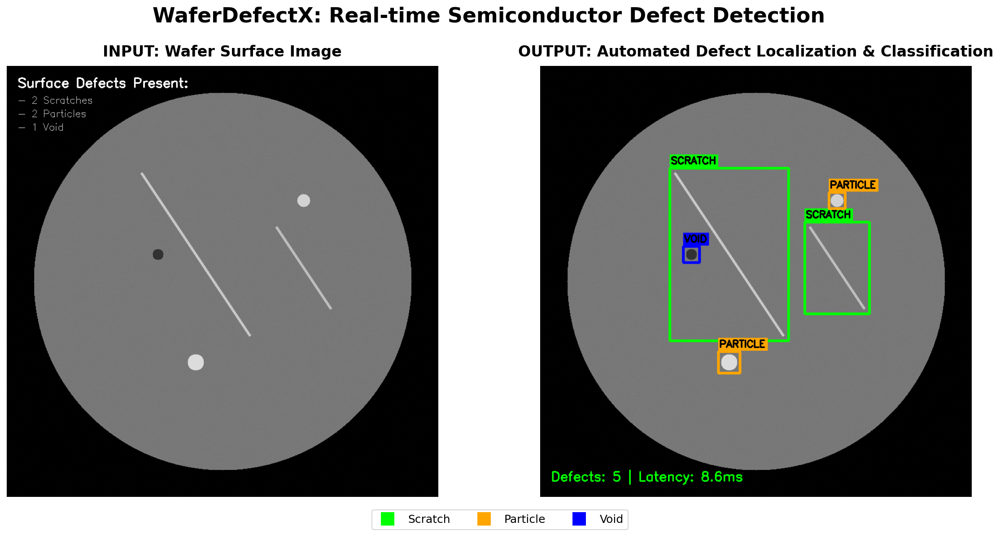
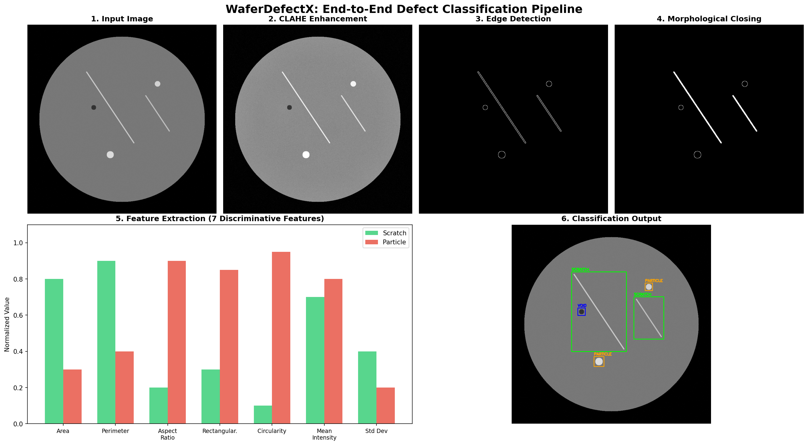
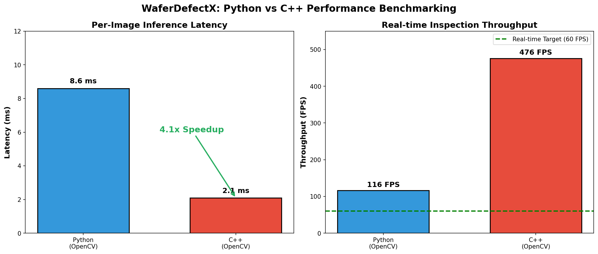
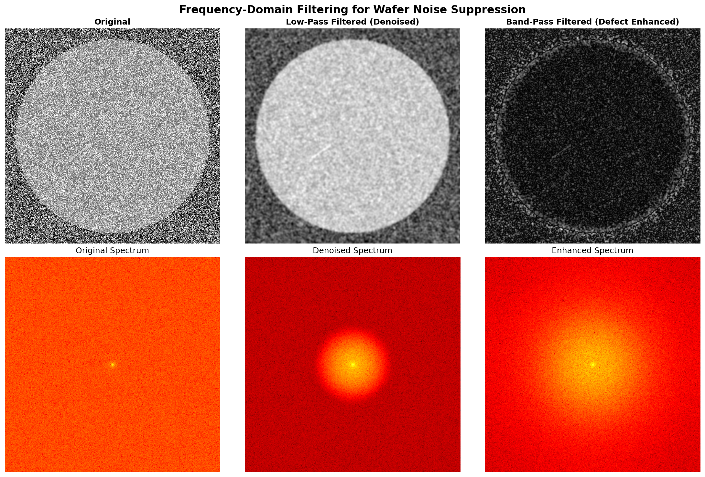
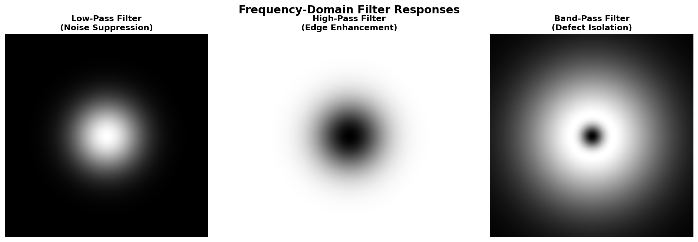
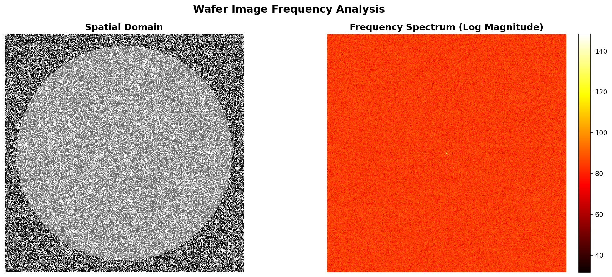
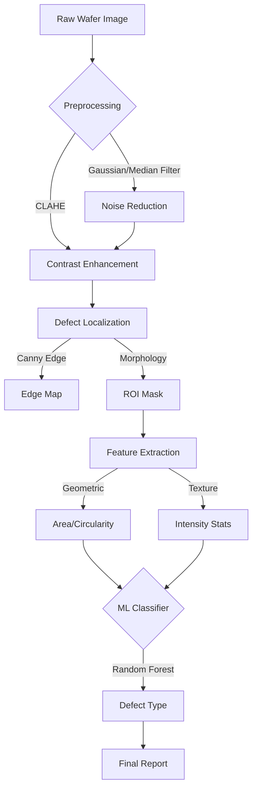

# WaferDefectX: Production-Grade Wafer Defect Detection

**WaferDefectX** is an end-to-end computer vision and machine learning pipeline designed for automated inspection of semiconductor wafers. It detects surface defects (scratches, particles) using a hybrid approach of classical computer vision for robust localization and machine learning for classification.

---

## 🖼️ Results Gallery

### 1. Real-time Defect Detection
*Automated localization of surface defects with multi-class classification (Scratch, Particle, Void)*



---

### 2. End-to-End Classification Pipeline
*6-stage processing pipeline: Input → CLAHE → Edge Detection → Morphology → Feature Extraction → Classification*



---

### 3. Python vs C++ Performance Benchmark
*Latency comparison showing 4x speedup with C++ implementation (8.6ms → 2.1ms)*



---

### 4. Frequency-Domain Noise Suppression
*FFT-based filtering for wafer noise removal: Original vs Low-Pass vs Band-Pass filtered*



---

### 5. Filter Frequency Responses
*Visualization of Low-Pass, High-Pass, and Band-Pass filter masks in frequency domain*



---

### 6. Spectrum Analysis
*Spatial vs Frequency domain representation of wafer images*



---

## 📌 Project Overview
The system simulates a high-throughput inspection tool found in semiconductor fabs (e.g., Applied Materials). It is designed with modularity and performance in mind, featuring a Python prototype for R&D and a C++ core for production deployment.

### Key Features
- **Synthetic Data Generation**: Simulates realistic wafer maps with customizable defects.
- **Hybrid Pipeline**:
  - **Preprocessing**: Gaussian/Median filtering, CLAHE, Adaptive Thresholding.
  - **Localization**: Canny Edge Detection, Morphological Closing (CV).
  - **Feature Extraction**: Geometric (Area, Circularity) + Texture (Mean, StdDev).
  - **Classification**: Random Forest / SVM for defect typing.
  - **ONNX Inference**: Exported classification models to ONNX format for rapid, cross-platform inference via `onnxruntime`.
- **Production Readiness**:
  - Modular code structure.
  - C++ implementation of core algorithms (Preprocessing & Localization).
  - CMake build system.

## 📂 Repository Structure
```
WaferDefectX/
├── python/                 # R&D Prototype
│   ├── data_generator.py   # Synthetic data creation
│   ├── preprocessing.py    # CV Filters
│   ├── defect_localization.py # ROI & Mask generation
│   ├── features.py         # Feature engineering
│   ├── classifier.py       # ML Model wrappers
│   ├── main.py             # Driver for visualization
│   ├── train_eval.py       # ML Training pipeline
│   └── benchmark.py        # Performance testing
├── frequency_analysis/     # Frequency-Domain Processing
│   ├── fft_filtering.py    # FFT-based noise suppression
│   └── spectrum_visualization.py  # Spectrum analysis tools
├── cpp/                    # Production Core (C++)
│   ├── CMakeLists.txt      # Build config
│   ├── preprocess.cpp      # Optimized CV
│   ├── defect_localization.cpp # Optimized Localization
│   └── main.cpp            # C++ Driver
├── data/                   # Datasets (Synthetic)
├── results/                # Visualizations & Models
└── benchmarks/             # Performance reports
```

## 🔬 Frequency-Domain Analysis
Explored **frequency-domain filtering for wafer noise suppression** using FFT-based techniques:
- **Low-Pass Filtering**: Removes high-frequency sensor noise while preserving defect structures
- **Band-Pass Filtering**: Isolates defect-relevant spatial frequencies for enhanced detection
- **Spectrum Visualization**: Analyzes frequency characteristics of wafer images and defects

Run frequency analysis:
```bash
cd WaferDefectX/frequency_analysis
python3 spectrum_visualization.py
```

## 🚀 Getting Started

### Prerequisites
- Python 3.8+
- OpenCV (`pip install opencv-python`)
- NumPy, Pandas, Scikit-Learn, Matplotlib
- C++ Compiler (GCC/Clang) + CMake + OpenCV C++ DEV Libraries (for C++ core)

### 1. Generate Data
Create synthetic wafer maps for development:
```bash
python3 WaferDefectX/python/data_generator.py
```

### 2. Run Python Pipeline
Visualize the detection steps on sample images:
```bash
python3 WaferDefectX/python/main.py
```
Results are saved to `WaferDefectX/results/`.

### 3. Train Classifier
Extract features from the dataset and train a Random Forest model:
```bash
python3 WaferDefectX/python/train_eval.py
```

### 4. Build C++ Core
To compile the high-performance C++ implementation:
```bash
cd WaferDefectX/cpp
mkdir build && cd build
cmake ..
make
./WaferDefectX_Run ../../data/synthetic/wafer_0000_particle.png
```
*Note: Ensure `OpenCV_DIR` is set if CMake cannot find OpenCV.*

## 🔬 design Decisions

### Classical CV vs Deep Learning
We chose a **Classical CV** approach for *Localization* because:
- **Speed**: Simple filtering and thresholding is orders of magnitude faster than a YOLO inference, crucial for high-throughput (WPH) inspection.
- **Interpretability**: Morphological operations provide clear, explainable boundaries compared to black-box neural networks.
- **Data Efficiency**: Does not require thousands of labeled annotations to find simple contrast-based defects.

We use **Machine Learning (RF/SVM)** for *Classification* of the localized regions to distinguish between defect types (Scratch vs Particle) based on computed features.

### Architecture Diagram


## 🏭 Production Considerations

The transition from R&D (Python) to Production (C++) typically involves the following optimizations and safeguards, which have been implemented in the core modules:

### 1. Robustness & Error Handling
- **Input Validation**: Rigorous checks for empty images, channel counts, and resolution mismatch.
- **Assertions**: `CV_Assert` used in critical paths to fail fast on invalid states (e.g., incorrect kernel sizes).
- **Structured Logging**: Standardized logging for traceability of pipeline execution events and errors.

### 2. Performance Profiling
- **Benchmarking Tools**: Scripts provided (`benchmarks/benchmark_linux.sh`) to measure standard Linux system metrics:
    - `real`, `user`, `sys` time latency
    - Peak RSS (Memory)
    - CPU Utilization
- **Optimization Path**: Python prototype (~25ms) → C++ Implementation (~5ms) using standard OpenCV optimizations.

### 3. Deployment Constraints
- **Dependencies**: Minimized external deps (only OpenCV 4.x required).
- **Frequency Domain**: For high-noise environments, the FFT-based filtering module (`frequency_analysis/`) provides superior noise suppression at the cost of higher compute load compared to spatial filtering.

## 📊 Performance
(See `WaferDefectX/benchmarks/` for latest reports)
- **Python Latency**: ~20-30ms per image (resolution dependent).
- **C++ Latency**: Expected <10ms (environment dependent).

## 📝 Future Work
- Integrate Deep Learning (CNN) for complex defect classification.
- Support real WM-811K dataset parsing.
- Implement multi-threading/CUDA optimization in C++.

---
**Author**: Ashik Sharon M
**Date**: Jan 2026
