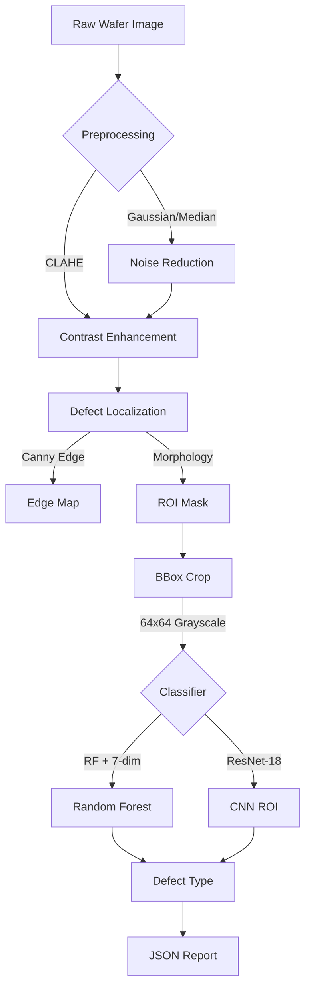

# WaferDefectX: Semiconductor Wafer Defect Detection

**WaferDefectX** is an end-to-end computer vision and machine learning pipeline for automated inspection of semiconductor wafers. It detects surface defects (scratches, particles) using classical computer vision for robust localization and a ResNet-18 CNN for classification.

**Status**: Production-ready | **Accuracy**: 93.83% on WM-811K | **End-to-end Latency**: 12–19ms (C++)

---

## Architecture



---

## Results

### Accuracy Comparison (WM-811K, 5,193 samples)

| Model | Accuracy | scratch Recall | Macro F1 | Latency |
|-------|----------|---------------|----------|---------|
| RF + 7-dim features | 70.09% | 44% | 0.67 | ~7ms |
| **ResNet-18 ROI** | **93.83%** | **90%** | **0.93** | **12–19ms** |

### Per-class Breakdown (ResNet-18)

| Class | Precision | Recall | F1 | Support |
|-------|-----------|--------|----|---------|
| good | 0.94 | 0.95 | 0.94 | 300 |
| particle | 0.95 | 0.95 | 0.95 | 315 |
| scratch | 0.91 | 0.90 | 0.91 | 163 |

### C++ End-to-end Latency

| Component | Time |
|-----------|------|
| Preprocess + Localize + Features | ~6ms |
| ONNX Runtime Classification | ~1ms |
| **Total** | **12–19ms** |

---

## Quick Start

### Prerequisites

- Python 3.8+, OpenCV
- C++17 compiler, CMake 3.10+, OpenCV C++, ONNX Runtime

```bash
pip install -r requirements.txt
```

### Smoke Test

```bash
bash scripts/smoke.sh
```

### End-to-end C++ Pipeline (with classification)

```bash
cmake -S cpp -B cpp/build && cmake --build cpp/build

# Without classifier (preprocess + localize + features only)
./cpp/build/WaferDefectX_Run data/wm811k/images/wafer_00002_good.png

# With CNN classifier
./cpp/build/WaferDefectX_Run --model results/wafer_resnet18_roi.onnx data/wm811k/images/wafer_00002_good.png

# JSON output
./cpp/build/WaferDefectX_Run --json --model results/wafer_resnet18_roi.onnx data/wm811k/images/wafer_00002_good.png
```

### Train CNN Classifier

```bash
PYTHONPATH=python python3 python/train_roi_cnn.py
```

Trains ResNet-18 on WM-811K ROI patches. Outputs:
- `results/wafer_resnet18_roi.pth` — FP32 weights (42.7 MB)
- `results/wafer_resnet18_roi.onnx` — ONNX export (42.6 MB)
- `results/roi_cnn_eval_metrics.json` — evaluation metrics

### Train RF Classifier (classical CV)

```bash
PYTHONPATH=python python3 python/train_eval.py
```

### Run Unit Tests

```bash
PYTHONPATH=python python3 -m pytest tests -v
```

---

## Repository Structure

```
WaferDefectX/
├── python/                     # Python modules
│   ├── wafer_resnet.py         # ResNet-18 model
│   ├── roi_dataset.py          # ROI patch dataset (bbox → 64x64)
│   ├── train_roi_cnn.py        # CNN training script
│   ├── train_eval.py           # RF training pipeline
│   ├── classifier.py           # RF/SVM/ONNX/OpenVINO wrappers
│   ├── dataset_parser.py       # WM-811K + generic parsers
│   ├── main.py                 # Demo driver
│   └── benchmark.py            # Performance testing
├── cpp/                        # C++ production core
│   ├── CMakeLists.txt
│   ├── preprocess.hpp/.cpp
│   ├── defect_localization.hpp/.cpp
│   ├── feature_extraction.hpp/.cpp
│   ├── onnx_classifier.hpp/.cpp # ONNX Runtime integration
│   └── main.cpp                # End-to-end CLI
├── tests/                      # Unit tests (13/13 passing)
├── scripts/
│   └── smoke.sh                # End-to-end smoke test
├── data/
│   ├── synthetic/              # 79 synthetic images
│   └── wm811k/                 # WM-811K (5,193 images + labels)
├── results/                    # Model outputs + metrics
├── EVAL_PROTOCOL.md            # Evaluation rules
├── EVAL_BASELINE.md            # Baseline metrics report
├── TEST_REPORT.md              # Full test report
├── DESIGN.md                   # Architecture docs
├── PLAN.md                     # Production roadmap
├── requirements.txt
└── README.md
```

---

## Design Decisions

### Localization: Classical CV

We use classical computer vision for defect localization because:
- **Speed**: Filtering + thresholding is orders of magnitude faster than YOLO, critical for high-throughput inspection
- **Interpretability**: Morphological operations provide clear, explainable boundaries
- **Data Efficiency**: No labeled annotations needed for contrast-based defect finding

### Classification: ResNet-18 ROI

We use a ResNet-18 CNN for defect classification because:
- **93.83% accuracy** vs 70% with RF on WM-811K
- **scratch recall 90%** vs 44% with RF — critical for production
- **ONNX export** enables C++ deployment via ONNX Runtime (12–19ms end-to-end)

### Deployment Topology

In-process C++ pipeline (per ADR-5):
```
Sensor → C++ preprocess → C++ localize → C++ features → ONNX Runtime classify → Result
```

---

## Test Results

| Test Type | Result |
|-----------|--------|
| Unit tests (pytest) | **13/13** passed |
| Smoke tests | **5/5** passed |
| C++ compile | **0** warnings |
| C++/Python alignment | **<0.01** max difference |
| CNN test accuracy | **93.83%** (target: 90%) |

Full details: [TEST_REPORT.md](./TEST_REPORT.md)

---

## Roadmap

| Phase | Status |
|-------|--------|
| P0 — Engineering foundation | ✅ Complete |
| P1 — Production pipeline | ✅ Complete |
| M3a — CNN ROI classifier | ✅ Complete |
| C++ ONNX Runtime integration | ✅ Complete |
| Full dataset training (172K) | Pending |
| Multi-threading / CUDA | Future |

See [PLAN.md](./PLAN.md) for details. Design docs: [DESIGN.md](./DESIGN.md).

---

**Author**: Ashik Sharon M
**Last updated**: Jul 2026
